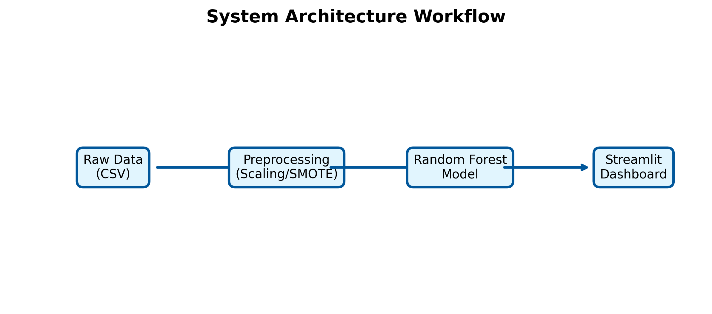
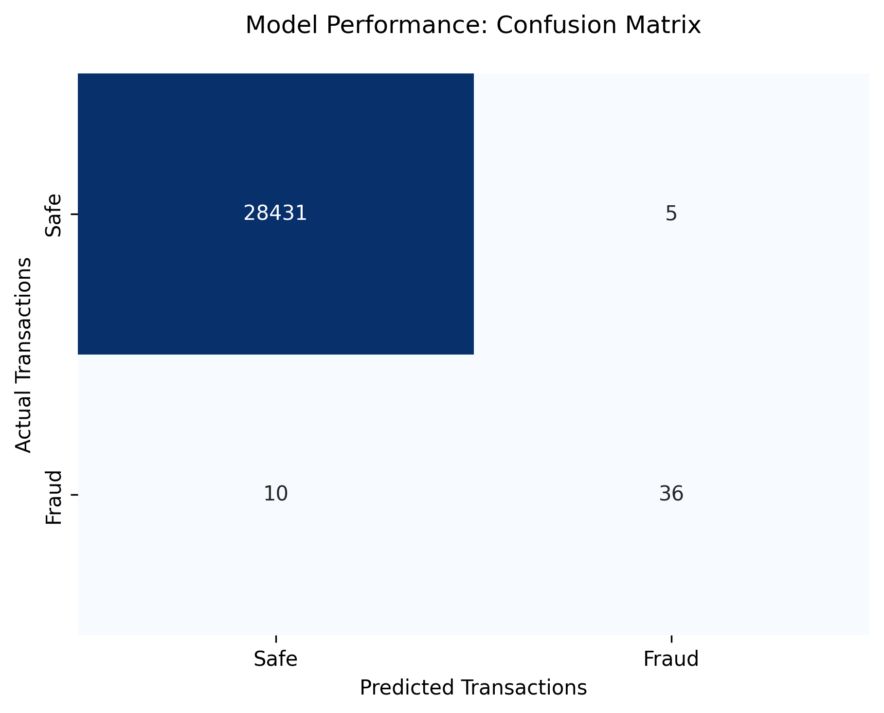

# 💳 Credit Card Fraud Detection System


## 📌 Project Overview
This project implements a robust **AI-Powered Fraud Detection System** designed to identify fraudulent credit card transactions. Using a Random Forest Classifier, the system achieves high precision in detecting anomalies within highly imbalanced financial datasets.

## 🏗️ System Architecture
The system follows a standard data science pipeline from ingestion to deployment:


## 📊 Model Performance
To ensure reliability, the model was evaluated using a Confusion Matrix, focusing on minimizing False Negatives (missed fraud cases).


### Key Metrics:
- **Algorithm:** Random Forest Classifier
- **Features:** PCA-transformed transaction features
- **Handling Imbalance:** Tested with SMOTE/Standard Scaling

## 📂 Project Structure
```text
├── data/               # Raw and processed datasets
├── images/             # System architecture and performance plots
├── models/             # Serialized .joblib model and scaler files
├── notebooks/          # Modularized research and training steps
├── app.py              # Streamlit Dashboard interface
└── requirements.txt    # Project dependencies
